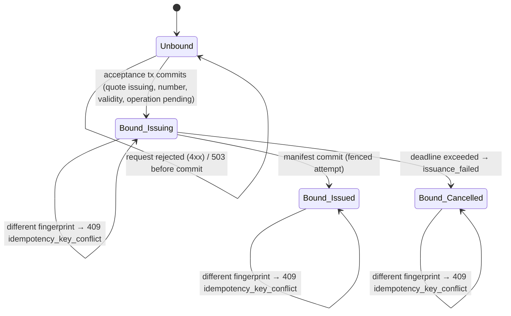

# Quote Service V2 — Idempotency, Issuance Recovery and Reconciliation

Status: **FROZEN (R1.2)**. Normative. Shapes: [openapi.yaml](openapi.yaml)
(`IdempotencyLookup`, `Operation`, `QuoteOperationResult`).

## 1. Invariants

- **I-1 (one logical result per key).** Within one principal, one operation
  and one `Idempotency-Key`, at most one binding exists, and it is bound to
  exactly one resource for its whole retention. For
  `quote.create_and_issue` that means: **one key → at most one quote → at most
  one quote number**, regardless of retries, concurrency, process death or
  worker count.
- **I-2 (commit-or-nothing).** A binding is created only in the same database
  transaction that commits the mutation's effect. A rejected request (4xx) or
  a dependency failure before commit (503) binds nothing.
- **I-3 (no silent divergence).** The same key with a different semantic
  request is always `409 idempotency_key_conflict`; it never yields a second
  resource and never modifies the bound one.
- **I-4 (replay before re-evaluation).** A request whose key is bound is
  answered from the binding before resource, semantic, state or version
  checks are evaluated.
- **I-5 (no secret material).** Raw keys are never stored, logged or returned;
  the service stores and logs `SHA-256(key)` only.

## 2. Keys, scope and fingerprint

| Item | Rule |
|---|---|
| Header | `Idempotency-Key`, required on every V2 mutation; 1–200 printable ASCII characters (`!`…`~`), no spaces |
| Scope | `(authenticated principalId, operation name, SHA-256(key))` |
| Operation names | `quote.create_and_issue`, `quote.draft.create`, `quote.draft.update`, `quote.issue`, `quote.cancel`, `quote.delivery.email` |
| Cross-principal | Impossible: a principal never sees, replays or conflicts with another principal's keys |
| Cross-operation | Independent bindings: the same key value may be used for different operations |
| Fingerprint | `SHA-256(JCS({"operation": <name>, "pathParameters": {...}, "body": <body′>}))` where JCS is RFC 8785 canonical JSON, `pathParameters` is `{}` or `{"quoteId": "<uuid>"}`, and `body′` is the received JSON body with `externalCorrelation.correlationId` removed |
| Normalization | None beyond JCS. Decimal strings are canonical by schema; strings are not trimmed or case-folded. Different spellings of the same value are rejected by schema rather than silently equated |

## 3. Bindings

### 3.1 Persisted record

`principal_id`, `operation`, `key_hash`, `request_fingerprint`,
`request_snapshot` (the full received body, immutable, including the
committing request's `correlationId`), `resource_type` (`quote` | `delivery`),
`quote_id`, `operation_id` (issuance) or `delivery_id`, `bound_at`.
Unique constraint on `(principal_id, operation, key_hash)`.

There is no `in_progress` binding state: the binding and the effect commit
together (I-2). Long-running work after acceptance (document rendering) is
represented by the **issuance operation**, not by the binding.

### 3.2 Request outcomes

| Situation | Response |
|---|---|
| Not bound, request valid, commit succeeds | New result (`201`/`202`/`200` per [domain contract §4.3](QUOTE_V2_DOMAIN_CONTRACT.md#43-response-status-as-a-function-of-state)); binding created |
| Not bound, request rejected (4xx) or dependency failure (503) | Error; nothing bound; the same key may be retried |
| Bound, same fingerprint | **Replay**: same logical resource in its **current** state, status code per §4.3, header `Idempotent-Replay: true`, audit `idempotency.replayed` |
| Bound, different fingerprint | `409 idempotency_key_conflict` (`details.operation`, `details.boundRequestFingerprint`); audit `idempotency.conflict` on the bound quote |
| Two concurrent first requests, same scope | The second blocks on the unique constraint until the first commits (then replay or conflict) or rolls back (then it proceeds normally) |

Replays return current state, not a stored response snapshot: a replay of a
create-and-issue whose quote has since been issued returns `201` with
`status = issued`; one whose quote has since expired returns `201` with
`status = expired`.

### 3.3 Lookup — `GET /v2/idempotency/current`

Headers: `Idempotency-Key`. Query: `operation`. Scope: `quotes:read`; the
principal is implied. Returns `200` with `state = bound` and
`{boundAt, requestFingerprint, resourceType, quoteId, operationId,
deliveryId, quoteStatus}`, or `state = not_found` with `binding = null`.

`not_found` is **final** for a given attempt only when the caller knows that
attempt can no longer commit: the service aborts any acceptance transaction
that has not committed within **10 s** of receiving the complete request
(`acceptanceTimeoutMs`, contract constant). A caller that observes `not_found`
at least 30 s after the attempt's connection ended (response, timeout or
abort) MAY treat the attempt as not applied. Replaying the frozen request
(§6) never requires this reasoning and is always safe.

### 3.4 Retention

Bindings and their request snapshots are retained for as long as the bound
quote is retained. Until a PII retention policy is ratified (open decision,
[freeze record](QUOTE_V2_CONTRACT_FREEZE.md)), **no quote and no binding is
ever deleted**. When a retention policy is introduced it MUST keep a
tombstone (`principal_id, operation, key_hash, request_fingerprint,
quote_id`) for at least as long as the quote number remains referenceable, so
I-1 holds for the key's lifetime.

## 4. Issuance operation: lease, fencing and recovery

### 4.1 Durable record

`operation_id`, `quote_id`, `status` (`pending | running | succeeded |
failed`), `generation` (fencing token, bigint), `lease_owner` (instance id),
`lease_expires_at`, `attempt_count`, `last_attempt_at`, `last_error_code`,
`next_attempt_at`, `accepted_at`, `deadline_at`, `completed_at`.

Created `pending` in the acceptance transaction together with the frozen
snapshot, number and validity.

### 4.2 Configuration

| Parameter | Default | Range |
|---|---|---|
| `syncIssueBudgetMs` | 5000 | 0–10000 |
| `issuanceLeaseMs` | 60000 | 10000–300000 (renewed every third of the lease) |
| `issuancePollIntervalMs` | 2000 | 500–60000 |
| `issuanceDeadline` | 24 h | 1 h–72 h (copied to `deadline_at` at acceptance) |
| Backoff after failed attempt *n* | 5 s, 30 s, 2 min, 10 min, 30 min, then 60 min | fixed schedule, capped by `deadline_at` |

### 4.3 Attempt protocol

```
claim (tx):   UPDATE op SET status='running', generation=generation+1,
                     lease_owner=:me, lease_expires_at=now()+lease,
                     attempt_count=attempt_count+1, last_attempt_at=now()
              WHERE operation_id=:id AND now() < deadline_at AND
                    ( (status='pending' AND next_attempt_at <= now())
                   OR (status='running' AND lease_expires_at < now()) )
              RETURNING generation            -- :g; no row → not ours
1. load the frozen snapshot from the database (never from the request)
2. render PDF bytes (pinned rendererVersion/templateVersion of this release)
3. sha = SHA-256(bytes); write temp file, fsync, atomic rename to
   artifacts/sha256/<aa>/<bb>/<sha>.pdf (if present: verify, reuse)
4. re-read and verify sha                    -- ARTIFACT WRITE BEFORE MANIFEST
commit (tx):  UPDATE op SET status='succeeded', completed_at=now()
              WHERE operation_id=:id AND generation=:g AND status='running'
              -- 0 rows → fenced out: abandon (file is harmless)
              INSERT manifest; UPDATE quote SET status='issued', version+1
              WHERE status='issuing'; INSERT audit quote.issued
5. respond (inline path only)                -- MANIFEST COMMIT BEFORE RESPONSE
on failure (tx, fenced by :g): status='pending', last_error_code,
              next_attempt_at=now()+backoff(attempt_count);
              audit quote.issue.attempt_failed
lease renewal: UPDATE … SET lease_expires_at=now()+lease
              WHERE operation_id=:id AND generation=:g   -- 0 rows → stop
```

Deadline sweep (worker): for operations with `now() ≥ deadline_at` that are
`pending`, or `running` with an expired lease, in one transaction: bump
`generation`, set operation `failed` (`issuance_deadline_exceeded`), quote
`cancelled` (`reasonCode = issuance_failed`, `initiatedBy = system`), audit
`quote.issue.failed` + `quote.cancelled`. A holder with a live lease is never
pre-empted; it either commits or fails before its lease expires, and a commit
after the sweep is impossible because the generation changed.

### 4.4 Inline (synchronous) path

After the acceptance commit the request handler performs a normal claim (it
obtains generation 1) and runs the attempt. If the manifest commits within
`syncIssueBudgetMs` it answers `201`/`200`; otherwise it answers `202` and
the attempt continues under its lease (or, if the handler's process dies, the
worker reclaims it after the lease). The handler never answers `201`/`200`
before the manifest commit.

### 4.5 Process death and restart

No recovery logic depends on the supervisor restarting the process. Any
instance's issuance worker reclaims expired leases. Graceful shutdown stops
claiming, lets in-flight attempts finish until the shutdown timeout, then
exits; unfinished leases simply expire.

### 4.6 Crash windows

| Crash point | Durable state | Recovery | Result |
|---|---|---|---|
| Before acceptance commit | nothing | caller replays (same key) | one quote created by the replay |
| After acceptance commit, before response | quote `issuing`, binding, operation `pending`/`running` | worker claims after lease/poll; caller replay or lookup finds the binding | same quote, same number |
| During render / file write | as above; maybe a partial temp file | lease expiry → new generation → re-render; temp files are never referenced | same quote |
| After artifact write, before manifest commit | as above; complete content-addressed file | new attempt re-renders or reuses and verifies the same address; commits | same quote; same bytes if renderer deterministic, otherwise the committed manifest's bytes |
| After manifest commit, before response | quote `issued` | caller replay → `201`/`200`; lookup → `bound`, `quoteStatus = issued` | same quote |
| Zombie holder after lease loss | — | its commit/renewal/failure updates match 0 rows (stale generation) | no effect |
| Storage/renderer down until deadline | operation `pending` with backoff | deadline sweep | quote `cancelled` (`issuance_failed`), number never on a document; caller needs a new key for a new quote |

## 5. Email delivery idempotency (when enabled)

Binding `quote.delivery.email` → `delivery_id`, same rules as §3. The outbox
worker uses the same lease/generation pattern. A provider call whose outcome
is ambiguous (timeout after send, crash after the provider accepted) marks the
delivery `unknown` and is not retried automatically. A new key is a deliberate
new delivery.

## 6. Consumer reconciliation procedure (normative guidance)

Classify every mutation attempt:

| Observation | Class | Action |
|---|---|---|
| `201`/`200`/`202` with body | SUCCEEDED (accepted) | Keep `quoteId`/`operationId`; for issuance poll `GET /v2/operations/{id}` (or `GET /v2/quotes/{id}`) until `status ≠ issuing` |
| `400`, `401`, `403`, `404`, `413`, `422`, `409 version_conflict`, `409 invalid_state_transition`, `409 operation_in_progress`, `503` | FAILED_BEFORE_COMMIT | Nothing bound. Retrying with the same key is safe; decide whether to retry |
| `409 idempotency_key_conflict` | CALLER DEFECT | The key is bound to a different request: the caller changed its frozen body. Do not create anything; investigate |
| Timeout, connection reset, no response, `500 internal_error` | UNKNOWN_AFTER_REQUEST | Reconcile (below) |

Reconciling UNKNOWN:

1. **Replay** the frozen request (identical semantic body, same key). The
   response is the bound result (`Idempotent-Replay: true`) or, if nothing
   was committed, the first real execution. Either way at most one quote
   exists.
2. Alternatively **look up** `GET /v2/idempotency/current?operation=…` with the
   key: `bound` → read the quote/operation; `not_found` → see §3.3 before
   treating as not applied.
3. Secondary evidence only: `GET /v2/quotes?sourceSystem=…&externalReferenceType=…&externalReference=…`
   (several quotes may match; this is not a uniqueness mechanism).

A consumer MUST NOT change any body member under the same key, and MUST NOT
treat `issuing` as success.

## 7. Key lifecycle diagram (create-and-issue)



ASCII equivalent:

```
            4xx / 503 (nothing committed)
           ┌──────────────┐
           ▼              │
       [Unbound] ─────────┘
           │ acceptance commit
           ▼
   [Bound: issuing] ──replay──► 202 (same quote)        any state + different
       │         │                                     fingerprint → 409
       │         └─deadline─► [Bound: cancelled/issuance_failed] ──replay──► 201
       │ fenced manifest commit
       ▼
   [Bound: issued*] ──replay──► 201 (same quote; *issued, expired or cancelled)
```
